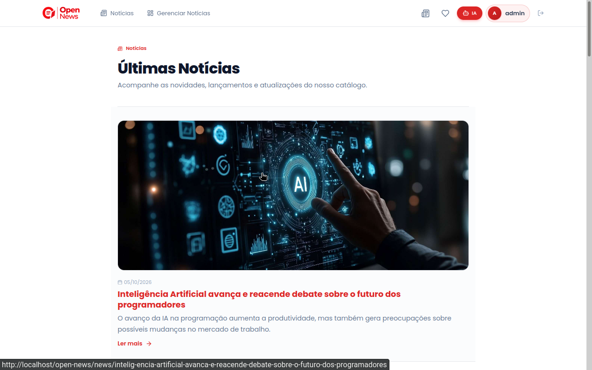
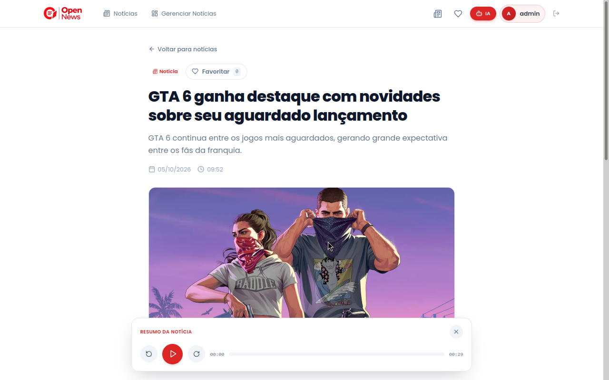
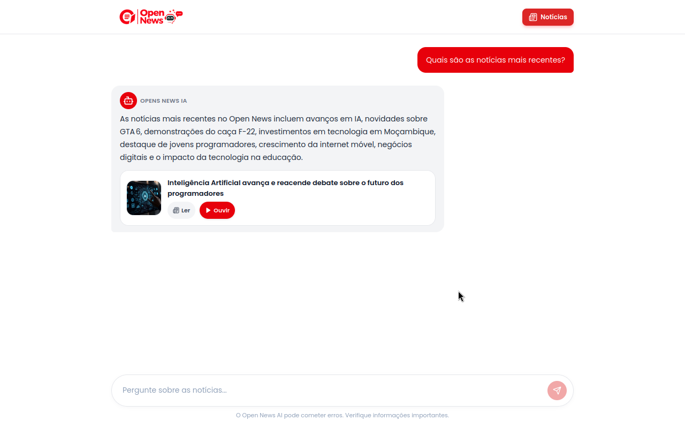
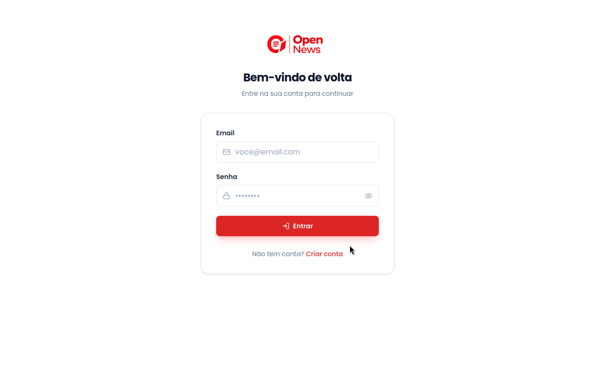
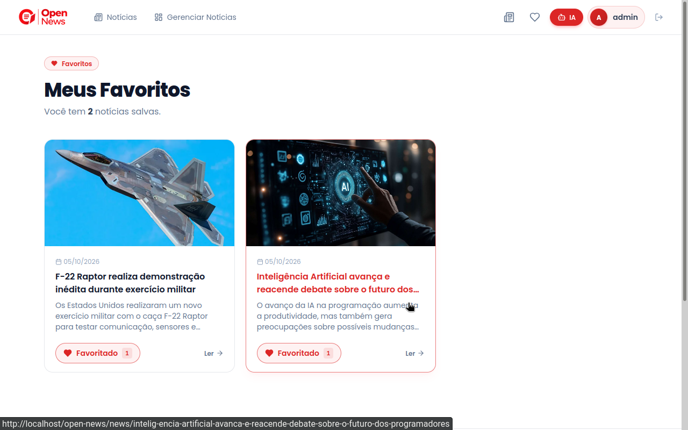

<h1 align="center" style="font-weight: bold;">Open News</h1>

<p align="center">
  <a href="#about">About</a> •
  <a href="#technologies">Technologies</a> •
  <a href="#started">Getting Started</a> •
  <a href="#features">Features</a> •
  <a href="#project-structure">Project Structure</a> •
  <a href="#contribute">Contribute</a>
  <a href="#screenshots">Screenshots</a> •
</p>

<p align="center">
  <b>A modern web-based news platform built with PHP, featuring user accounts, news favorites, audio summaries, and an integrated AI chat.</b>
</p>

---

<h2 id="about">📰 About</h2>

<p>
  <b>OpenNews</b> is a web-based news platform built with <b>PHP</b>,
  designed to provide users with a simple and modern way to discover,
  read, listen to, and interact with news.
</p>

<p>
  The platform allows users to <b>create accounts</b>, browse published news,
  <b>favorite articles</b>, and listen to <b>audio summaries</b> of news
  for a more accessible and convenient experience.
</p>

<p>
  OpenNews also includes an integrated <b>AI chat</b> that allows users to
  have conversations about the news, ask questions, and get information
  related to published articles.
</p>

<p>
  The project was designed with a focus on <b>simplicity, maintainability,
  security, and scalability</b>, using a custom PHP architecture to keep
  the application's core fully controlled by the project.
</p>

---

<h2 id="screenshots">📸 Screenshots</h2>

<p align="center">
  
</p>

<p align="center">
  
</p>

<p align="center">
  
</p>

<p align="center">
  
</p>

<p align="center">
  
</p>

---

<h2 id="technologies">💻 Technologies</h2>

* PHP 8+
* Custom PHP MVC Framework
* MySQL
* PDO
* HTML5
* CSS3
* JavaScript
* Vue.js
* Tailwind CSS
* Apache
* Git

<p>
  <b>Vue.js</b> is used specifically in the <b>AI Chat view</b> to provide
  a reactive and interactive user experience. It was introduced only where
  its reactive features were necessary, while the rest of the platform
  remains primarily built with PHP and server-rendered views.
</p>

---

<h2 id="started">🚀 Getting Started</h2>

<p>
  Follow the steps below to set up and run <b>Open News</b> in a local development environment.
</p>

<h3>Prerequisites</h3>

<p>
  Before running the project, make sure you have a local web server environment with
  <a href="https://httpd.apache.org/" target="_blank"><b>Apache</b></a> and
  <a href="https://www.mysql.com/" target="_blank"><b>MySQL</b></a>.
</p>

<p>
  You can install and manage these services separately, or use a local development
  environment such as
  <a href="https://www.apachefriends.org/" target="_blank"><b>XAMPP</b></a> or
  <a href="https://laragon.org/" target="_blank"><b>Laragon</b></a>.
</p>

<h3>Cloning</h3>

<p>Clone the repository to your local machine:</p>

```bash
git clone https://github.com/agideev/open-news.git

cd open-news
```
---

<h3>Database Configuration</h3>

<p>
  OpenNews uses <b>MySQL</b> as its database management system.
  The project includes SQL files inside the <code>database/</code> directory:
</p>

```text
database/
├── schema.sql
└── database.sql
```

<ul>
  <li>
    <code>schema.sql</code> — contains the database structure, including
    tables, columns, relationships, and constraints. This file is required
    to initialize the project database.
  </li>
  <li>
    <code>database.sql</code> — contains pre-populated data that can be
    imported if you want to test the project with existing news and data.
    Importing this file is optional.
  </li>
</ul>

<h4>1. Create the Database</h4>

<p>
  Create a MySQL database named <code>open_news_db</code>:
</p>

```sql
CREATE DATABASE open_news_db
CHARACTER SET utf8mb4
COLLATE utf8mb4_unicode_ci;
```

<h4>2. Configure the Database</h4>

<p>
  Configure your database credentials in the <code>.env</code> file:
</p>

```env
DB_HOST=127.0.0.1
DB_NAME=open_news_db
DB_USER=root
DB_PASS=
DB_CHARSET=utf8mb4
```

<p>
  Make sure these values match your local MySQL configuration.
</p>

<h4>3. Import the Database Schema</h4>

<p>
  After creating and configuring the database, import and execute the
  <code>schema.sql</code> file. This step is <b>required</b> because it
  creates the tables and relationships needed by OpenNews.
</p>

<p>
  You can execute the file using <b>phpMyAdmin</b> or another MySQL
  administration tool.
</p>

<p>
  If you are using phpMyAdmin:
</p>

<ol>
  <li>Open <b>phpMyAdmin</b>.</li>
  <li>Select the <code>open_news_db</code> database.</li>
  <li>Open the <b>Import</b> tab.</li>
  <li>Select <code>database/schema.sql</code>.</li>
  <li>Click <b>Import</b>.</li>
</ol>

<h4>4. Import Sample Data (Optional)</h4>

<p>
  If you want to test the project with a database that is already populated
  with sample data, you can also import <code>database.sql</code>.
</p>

<p>
  This step is <b>optional</b>. You can skip it if you want to start with
  an empty database and create your own news and users.
</p>

<p>
  In other words, the required setup is:
</p>

```text
Create database
      ↓
Configure .env
      ↓
Execute schema.sql
      ↓
Optional: Import database.sql
```
---

<h3>Database Administration</h3>

<p>
  After configuring the database and executing <code>schema.sql</code>,
  you can create an administrator account through the application's
  administration route:
</p>

```text
/myadmin
```
<p>
  <b>Important:</b> The <code>/myadmin</code> route can only be accessed <b>once</b>. It is intended exclusively for the initial administrator setup. After the administrator account has been created, this route becomes unavailable.
</p>

<p>
  The administrator email is defined by the application as:
</p>

```text
admin@gmail.com
```

<p>
  The administrator password is defined in the <code>.env</code> file:
</p>

```env
ADMIN_PASSWORD=adminagidev123
```

<p>
  After configuring the password, access <code>/myadmin</code> and follow
  the administration flow to create the administrator account.
</p>

<p>
  For security reasons, use a strong and unique password in production and
  never commit your <code>.env</code> file to the repository.
</p>

---

<h3>Environment Variables</h3>

<p>
  Configure the application environment by creating a <code>.env</code> file
  in the project root.
</p>

<p>Example configuration:</p>

```env
# Database Configuration

DB_HOST=127.0.0.1
DB_NAME=open_news_db
DB_USER=root
DB_PASS=
DB_CHARSET=utf8mb4

# Application Configuration

APP_NAME=Open News
APP_DEBUG=false
APP_URL=http://localhost/open-news/

# Admin Configuration

ADMIN_PASSWORD=change_me

# AI Configuration

GROQ_MODEL=
GROQ_API_KEY=
GROQ_FREE_USAGE=

# Upload Configuration

UPLOAD_MAX_SIZE=5242880
```

<h4>Variables</h4>

<ul>
  <li><code>DB_HOST</code> — MySQL server host.</li>
  <li><code>DB_NAME</code> — Name of the application database.</li>
  <li><code>DB_USER</code> — MySQL database username.</li>
  <li><code>DB_PASS</code> — MySQL database password.</li>
  <li><code>DB_CHARSET</code> — Character set used by the database connection.</li>

  <li><code>APP_NAME</code> — Name of the application.</li>
  <li><code>APP_DEBUG</code> — Enables or disables debug mode.</li>
  <li><code>APP_URL</code> — Base URL of the application.</li>

  <li><code>ADMIN_PASSWORD</code> — Password used to create the initial administrator.</li>

  <li><code>GROQ_MODEL</code> — Groq AI model used by the integrated chat.</li>
  <li><code>GROQ_API_KEY</code> — API key used to access the Groq API.</li>
  <li>
    <code>GROQ_FREE_USAGE</code> — Defines the maximum number of AI messages
  available to each user under the application's free usage limit.
  </li>

  <li><code>UPLOAD_MAX_SIZE</code> — Maximum allowed upload size in bytes.</li>
</ul>

<p>
  For security reasons, do not commit the <code>.env</code> file or expose
  your <code>GROQ_API_KEY</code> publicly.
</p>

---

<h3>🤖 AI Chat</h3>

<p>
  OpenNews includes an integrated <b>AI Chat</b> that allows users to
  interact with published news, ask questions, request explanations,
  and discuss the content of articles.
</p>

<p>
  The AI functionality is powered by the <b>Groq API</b>, which provides
  fast inference for supported language models. The application uses
  environment variables to configure the API key and the model used by
  the chat.
</p>

<h4>Groq Configuration</h4>

<p>
  To enable the AI Chat, create an account on <b>GroqCloud</b> and
  generate an API key. The key should be stored in the project's
  <code>.env</code> file and never exposed directly in the source code.
</p>

<p>
  Groq recommends storing the API key as an environment variable when
  integrating the API into an application.
</p>

<p>Configure the following variables:</p>

```env
# AI Configuration

GROQ_MODEL=openai/gpt-oss-20b
GROQ_API_KEY=your_groq_api_key
GROQ_FREE_USAGE=10
```

<ul>
  <li>
    <code>GROQ_MODEL</code> — Defines the AI model used by the chat.
  </li>
  <li>
    <code>GROQ_API_KEY</code> — Authentication key used to access the Groq API.
  </li>

</ul>

<p>
  In this project, <code>GROQ_FREE_USAGE=10</code> allows each user to send
  up to <b>10 AI messages</b> within the application's free usage limit.
  This value can be changed through the <code>.env</code> file.
</p>

<h4>Free Models</h4>

<p>
  Groq currently provides free-plan access with rate limits for several
  models suitable for testing and development.
</p>

<table>
  <thead>
    <tr>
      <th>Model</th>
      <th>Recommended Use</th>
    </tr>
  </thead>
  <tbody>
    <tr>
      <td><code>openai/gpt-oss-20b</code></td>
      <td>Good balance between speed and response quality.</td>
    </tr>
    <tr>
      <td><code>openai/gpt-oss-120b</code></td>
      <td>More capable model for more complex conversations.</td>
    </tr>
    <tr>
      <td><code>qwen/qwen3.8-27b</code></td>
      <td>Alternative model for general-purpose conversations.</td>
    </tr>
  </tbody>
</table>

<p>
  For local development and testing, <code>openai/gpt-oss-20b</code> is a
  good default because it provides fast responses while remaining within
  the current free-plan limits.
</p>

<p>
  Model availability and free-plan limits may change over time. Check the
  official Groq documentation for the current supported models and limits.
</p>

<h3>Running the Project</h3>

<p>
  If you are using <b>XAMPP</b> or <b>Laragon</b>, place the project inside
  the appropriate web root directory and make sure <b>Apache</b> and
  <b>MySQL</b> are running.
</p>

<p>
  For example, with XAMPP:
</p>

```text
C:\xampp\htdocs\open-news
```
<p> The application should then be accessible at: </p>

```text
C:\xampp\htdocs\open-news
```
<p> Make sure the value of <code>APP_URL</code> in your <code>.env</code> file matches the URL where the application is running. </p>

---

<h3>Tailwind CSS Setup</h3>

<p>
  OpenNews uses <b>Tailwind CSS 4</b> with the official Tailwind CLI.
  <b>Node.js</b> and <b>npm</b> are required to install the frontend
  dependencies and compile the project's CSS.
</p>

<h4>Prerequisites</h4>

<p>
  Make sure <b>Node.js</b> and <b>npm</b> are installed on your system.
</p>

```bash
node -v
npm -v
```

<h4>Installing Dependencies</h4>

<p>
  From the project root, install the required Node.js dependencies:
</p>

```bash
npm install
```

<p>
  This will install Tailwind CSS and the Tailwind CLI and create the
  <code>node_modules</code> directory.
</p>

<h4>Development</h4>

<p>
  During development, run the following command:
</p>

```bash
npm run dev
```

<p>
  This starts the Tailwind CLI in watch mode. Tailwind will automatically
  rebuild the CSS whenever the source files are modified.
</p>

<p>
  The generated stylesheet is located at:
</p>

```text
public/assets/css/app.css
```

<p>
  Keep the development process running while working on the frontend so that
  CSS changes are automatically compiled.
</p>

<h4>Production Build</h4>

<p>
  Before deploying the application, generate the optimized and minified CSS:
</p>

```bash
npm run build
```

<p>
  The command uses the following source and output files:
</p>

```text
resources/css/app.css
        ↓
   Tailwind CLI
        ↓
public/assets/css/app.css
```

<h4>Available NPM Scripts</h4>

| Command                    | Description                          |
| -------------------------- | ------------------------------------ |
| <code>npm install</code>   | Install project dependencies         |
| <code>npm run dev</code>   | Run Tailwind CSS in watch mode       |
| <code>npm run build</code> | Generate the minified production CSS |

<h4>Development Workflow</h4>

<p>
  A typical development environment requires both the PHP web server and the
  Tailwind development process to be running.
</p>

<p><b>Terminal 1 — Tailwind CSS:</b></p>

```bash
npm run dev
```

<p><b>Terminal 2 — PHP/Apache:</b></p>

<p>
  Start Apache through <b>XAMPP</b>, <b>Laragon</b>, or your preferred PHP
  development environment.
</p>

<p>
  Once both services are running, open the GameStore application in your browser.
</p>

---

<h2 id="features">✨ Features</h2>

<p>
  OpenNews provides a set of features for reading, managing, and interacting
  with news through a modern web-based platform.
</p>

<h3>📰 News Management</h3>

* Create and manage news articles.
* News title, summary, and content.
* Published and unpublished news status.
* News categories and organization.
* News detail pages.
* News images and visual content.
* Audio summaries that users can listen to directly from the news.

<h3>👤 User Management</h3>

* User registration and authentication.
* Login and logout.
* User accounts.
* Session-based authentication.

<h3>⭐ Favorites</h3>

* Add news to favorites.
* Remove news from favorites.
* Access favorited news.
* Personalized favorite news list.

<h3>🤖 AI Chat</h3>

* Integrated AI chat focused on news content.
* Ask questions about published news.
* Discuss and explore news topics with AI.
* Reactive chat interface powered by Vue.js.
* Configurable Groq AI model.
* Configurable free message usage limit.

<h3>🔐 Administration</h3>

* Initial administrator setup.
* News administration.
* Manage published content.
* Protected administrative functionality.

<h3>🖥️ Responsive Interface</h3>

* Modern and clean interface.
* Responsive design.
* Desktop and mobile support.
* Tailwind CSS 4.
* Interactive navigation and user interface.

---

<h2 id="project-structure">📁 Project Structure</h2>

<p>
  OpenNews follows a custom <b>MVC (Model-View-Controller)</b> architecture.
  The project is organized into separate directories to keep application logic,
  database operations, views, configuration, and public assets properly separated,
  making the codebase easier to maintain and extend.
</p>

```text
open-news/
│
├── app/
│   ├── Controllers/
│   ├── Models/
│   ├── Views/
│   ├── Core/
│   └── ...
│
├── config/
│   └── ...
│
├── docs/
│   ├── screenshots
│   └── ...
│
├── database/
│   ├── schema.sql
│   └── database.sql
│
├── public/
│   ├── uploads/
│   ├── assets/
│   ├── css/
│   ├── js/
│   ├── index.php
│   └── .htaccess
│
├── routes/
│   └── ...
│
├── .env
├── .env.example
├── .gitignore
├── .htaccess
├── package.json
├── package-lock.json
└── README.md
```
---

<h2 id="upcoming">🚀 Current Release</h2>

<h3>Current Version: <code>v1.0</code></h3>

<p>
  OpenNews is currently available as a <b>functional version</b>, with its
  core features implemented and ready for use.
</p>

<h3>📌 Version</h3>

```text
Current: v1.0s
Status:  Functional
```
---

<h2 id="contribute">📫 Contribute</h2>

<p>
  Contributions, suggestions, and improvements are welcome.
</p>

<p>
  To contribute to GameStore:
</p>

<ol>
  <li>Fork the repository.</li>
  <li>Create a new branch:</li>
</ol>

```bash
git checkout -b feature/your-feature
```

<ol start="3">
  <li>Make your changes.</li>
  <li>Test your changes locally.</li>
  <li>Commit your changes:</li>
</ol>

```bash
git add .
git commit -m "feat: describe your change"
```

<ol start="6">
  <li>Push your branch:</li>
</ol>

```bash
git push origin feature/your-feature
```

<ol start="7">
  <li>Open a Pull Request describing your changes.</li>
</ol>

---

<h2 id="license">📄 License</h2>

<p>
  This project is licensed under the terms specified in the project's
  <code>LICENSE</code> file.
</p>

---

<h2 align="center">🎮 GameStore</h2>

<p align="center">
  Built with PHP, MySQL and a custom MVC framework.
</p>

<p align="center">
  <b>OpenNews — A modern platform for reading and interacting with news.</b>
</p>
